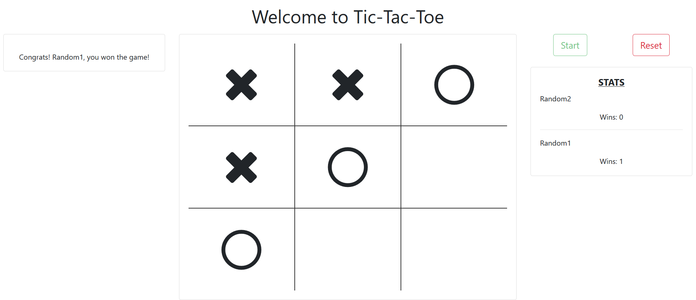

# JS TicTacToe [Live Link](#)

- JavaScript



## Usage
> Clone the repository to your local machine using ssh:
```
$ git clone git@github.com:rOluochKe/JS-TicTacToe.git
```
> Clone the repository to your local machine using https:
```
$ git clone https://github.com/rOluochKe/JS-TicTacToe.git
```
> cd into the directory
```
$ cd JS-TicTacToe
```
> Run Server Locally


## Functionalities
- The classic Tic Tac Toe game that all have played.
- Added players custom names
- Added players name validations
- Added players scores history
- Added reset functionality
- Added local storage functionality for score history
- Added turn notifier
- Vanilla Javascript
- Bootstrap user friendly interface

## Designed and developed by
[Raymond Oluoch](https://github.com/rOluochKe)
[Leonardo Mezu](https://github.com/leonmezu1)
